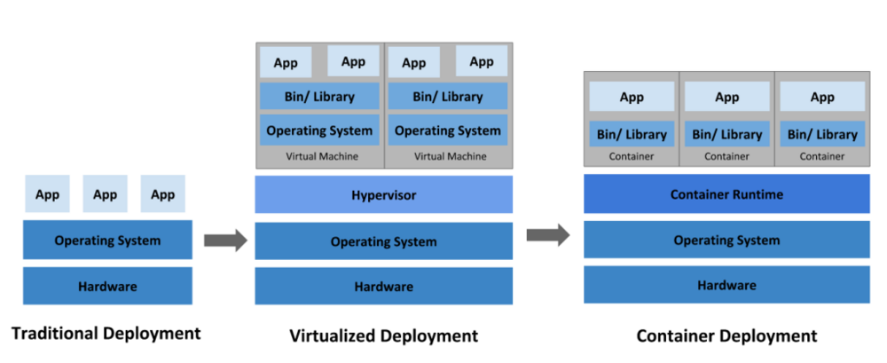
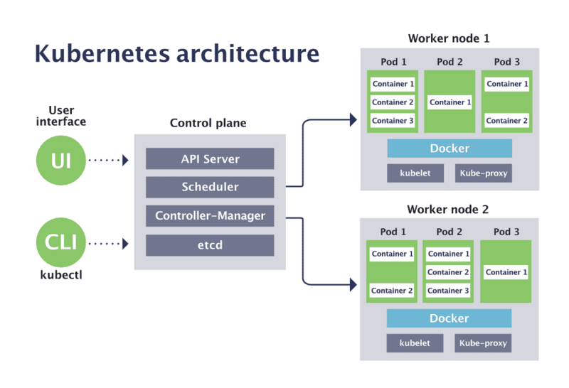

# kubernetes

## Introdução
>[!NOTE]
>O Kubernetes é uma plataforma de código aberto para automação, orquestração e gerenciamento de contêineres.


<br>
Ele simplifica a implantação e o dimensionamento de aplicativos em contêineres, fornecendo recursos como:
<br><br>

**Orquestração**: O Kubernetes automatiza a implantação, o balanceamento de carga, o escalonamento e a recuperação de contêineres, garantindo que os aplicativos estejam sempre disponíveis e em funcionamento.

**Gerenciamento de Recursos**: Ele aloca automaticamente recursos de computação (CPU, memória, armazenamento) para os contêineres com base nas necessidades, otimizando o uso de recursos.

**Implantações Contínuas**: O Kubernetes suporta implantações contínuas, permitindo a atualização de aplicativos sem interrupções de serviço, facilitando a entrega de novas versões de software.

**Escalonamento Automático**: Você pode configurar políticas de escalonamento automático para aumentar ou diminuir o número de réplicas de contêineres com base na carga de trabalho atual.

**Gerenciamento de Estado**: Ele suporta aplicativos de estado, como bancos de dados, por meio de controladores de estado, garantindo a persistência de dados e a recuperação de falhas.

**Desenvolvimento Multi-Nuvem**: O Kubernetes é agnóstico em relação à infraestrutura, permitindo que você implante aplicativos em nuvens públicas, data centers locais ou ambientes híbridos.

**Extensibilidade**: É altamente extensível, permitindo que você adicione funcionalidades personalizadas por meio de APIs e plugins.

**Comunidade Ativa**: Possui uma grande comunidade de desenvolvedores e um ecossistema de ferramentas e serviços relacionados, tornando-o uma escolha popular para a orquestração de contêineres.


<br><br><br><br>


### Arquitetura




<br><br><br><br>
## Instalação
Referência:
 https://kubernetes.io/pt-br/docs/setup/
https://devopscube.com/setup-kubernetes-cluster-kubeadm/

### Pré-requisitos
#### Verificando as portas necessárias

Referência:
 https://kubernetes.io/docs/reference/networking/ports-and-protocols/

Diversas portas precisam estar abertas para que os componentes do Kubernetes se comuniquem uns com os outros. O plugin de rede dos pods que você utiliza também pode requer que algumas portas estejam abertas.
Dito que essas portas podem diferir dependendo do plugin, por favor leia a documentação dos plugins sobre quais portas serão necessárias abrir.
     
<br>
#### Desativar a swap
Desative a troca em todos os nós.
Para que o kubelet funcione sem problemas, é recomendável desabilitar a troca. Execute os comandos a seguir nos nós mestre e do trabalhador para desativar a troca.

```shell
sudo swapoff -a
sudo sed -i '/ swap / s/^\(.*\)$/#\1/g' /etc/fstab
```
<br>
### Fazendo com que o iptables enxergue o tráfego agregado
Referência: 
https://kubernetes.io/pt-br/docs/setup/production-environment/tools/kubeadm/install-kubeadm/

Assegure-se de que o módulo br_netfilter está carregado. Isso pode ser feito executando o comando lsmod | grep br_netfilter.

Para carrega-lo explicitamente execute:

```shell
cat <<EOF | sudo tee /etc/modules-load.d/k8s.conf
overlay
br_netfilter
EOF
```
Recarregue os módulos:
```shell
sudo modprobe overlay
sudo modprobe br_netfilter
```

Como um requisito para que seus nós Linux enxerguem corretamente o tráfego agregado de rede, você deve garantir que a configuração net.bridge.bridge-nf-call-iptables do seu sysctl está configurada com valor 1. 
Como no exemplo abaixo:
```shell
cat <<EOF | sudo tee /etc/sysctl.d/k8s.conf
net.bridge.bridge-nf-call-iptables  = 1
net.bridge.bridge-nf-call-ip6tables = 1
net.ipv4.ip_forward                 = 1
EOF
```

<br>
```shell
sudo sysctl --system
```

<br><br><br><br>
## Configurando o Cluster
Referência:
 https://ubunlog.com/pt/como-instalar-kubernetes-en-ubuntu-y-derivados-y-crear-dos-nodos/


<br>

### Em todos os nodes (MASTER E WORKERS)


#### Docker engine
    sudo apt-get update
    sudo apt-get install -y apt-transport-https ca-certificates curl gnupg

    sudo apt-get update
    sudo apt-get install containerd

<br>

#### cgroup drivers
Referência:
 https://kubernetes.io/docs/setup/production-environment/container-runtimes/

Os cgroups são uma funcionalidade fundamental do Linux que permite controlar, limitar e isolar os recursos de sistema, como CPU, memória, E/S (entrada/saída) e outros, para processos individuais ou grupos de processos.

Configurando o cgroup driver para usar o systemd:

``` shell
sudo mkdir -p /etc/containerd
sudo containerd config default | sudo tee /etc/containerd/config.toml
```

Alterar SystemdCgroup = false para true

```shell
sed -e 's/SystemdCgroup = false/SystemdCgroup = true/g' -i /etc/containerd/config.toml
systemctl restart containerd
```
<br><br>

#### Kubeadm
Agora, a próxima etapa é adicionar a chave Kubernetes a ambos os nós, fazemos isso com o seguinte comando:
```shell
sudo curl -s https://packages.cloud.google.com/apt/doc/apt-key.gpg | sudo gpg --dearmour -o /etc/apt/trusted.gpg.d/kubernetes-archive-keyring.gpg
```
<br>
Adicione o repositório apt do Kubernetes:
```shell
echo "deb https://apt.kubernetes.io/ kubernetes-xenial main" | sudo tee /etc/apt/sources.list.d/kubernetes.list
```
<br>

Agora você instalará esses pacotes em todos os nodes:

>**kubeadm**: o comando para criar o cluster.
>
>**kubelet**: o componente que executa em todas as máquinas no seu cluster e cuida de tarefas como a inicialização de pods e contêineres.
>
>**kubectl**: a ferramenta de linha de comando para interação com o cluster.

<br> 

```shell
sudo apt-get update
sudo apt-get install -y kubelet kubeadm kubectl
sudo apt-mark hold kubelet kubeadm kubectl

systemctl start kubelet.service
systemctl enable kubelet.service
```

<br>
Agora, estamos prontos para criar o cluster Kubernetes!


            
<br><br>

#### Iniciando o Cluster
Referência:
https://kubernetes.io/docs/setup/production-environment/tools/kubeadm/create-cluster-kubeadm/
https://computingforgeeks.com/install-kubernetes-cluster-on-debian-12-bookworm/#google_vignette

<br>

##### Configurando Node Master

###### Inicializando o cluster (SOMENTE O MASTER)

Esteja certo que a swap está desativada:
```swapon -s```

<br>


Inicie o Cluster:
```kubeadm config images pull```

```shell
kubeadm init --control-plane-endpoint=<IP ou FQDN MASTER> --pod-network-cidr=10.244.0.0/16 | tee kubeadm.init.out
```

<br>

O arquivo de saída "kubeadm.init.out" será útil para consulta do comando para join dos workers.


Caso ocorra tudo bem, você receberá uma mensagem do tipo: 


```
To start using your cluster, you need to run the following as a regular user:

  mkdir -p $HOME/.kube
  sudo cp -i /etc/kubernetes/admin.conf $HOME/.kube/config
  sudo chown $(id -u):$(id -g) $HOME/.kube/config

Alternatively, if you are the root user, you can run:

  export KUBECONFIG=/etc/kubernetes/admin.conf

You should now deploy a pod network to the cluster.
Run "kubectl apply -f [podnetwork].yaml" with one of the options listed at:
  https://kubernetes.io/docs/concepts/cluster-administration/addons/

You can now join any number of control-plane nodes by copying certificate authorities
and service account keys on each node and then running the following as root:

  kubeadm join master01.local:6443 --token 32zo2e.rfcsfw70e40a3d6d \
	--discovery-token-ca-cert-hash sha256:61821c9449b082fa7d4232d95e2536a328b2c4f4364c3b001ec5b50d95adb014 \
	--control-plane 

Then you can join any number of worker nodes by running the following on each as root:

kubeadm join master01.local:6443 --token 32zo2e.rfcsfw70e40a3d6d \
	--discovery-token-ca-cert-hash sha256:61821c9449b082fa7d4232d95e2536a328b2c4f4364c3b001ec5b50d95adb014
```
<br><br>

###### Atenção!
Guarde a linha:

```
"kubeadm join master01.local:6443 --token 32zo2e.rfcsfw70e40a3d6d --discovery-token-ca-cert-hash sha256:61821c9449b082fa7d4232d95e2536a328b2c4f4364c3b001ec5b50d95adb014"
```
Ela será utilizada para adicionar os workers ao cluster.


Para usar seu cluster, faça o seguinte (conforme orientado na msg acima):
```shell
mkdir -p $HOME/.kube
sudo cp -i /etc/kubernetes/admin.conf $HOME/.kube/config
sudo chown $(id -u):$(id -g) $HOME/.kube/config
```
Ou:
```
export KUBECONFIG=/etc/kubernetes/admin.conf
```
<br>

Confirme se está tudo ok:
```
    kubectl cluster-info
```

<br><br><br><br>

##### Configurando o POD Network
Referência:
 https://kubernetes.io/pt-br/docs/concepts/cluster-administration/networking/

* Conectividade é uma parte central do Kubernetes, mas pode ser desafiador entender exatamente como é o seu funcionamento esperado.

<br>

* Existem 4 problemas distintos em conectividade que devem ser tratados:

>**Comunicações contêiner-para-contêiner altamente acopladas**: Isso é resolvido por Pods e comunicações através do localhost.

>**Comunicações pod-para-pod**: Esse é o foco primário desse documento.

>**Comunicações pod-para-serviço (service)**: Isso é tratado em Services.

>**Comunicações Externas-para-serviços**: Isso é tratado em services.

<br>

Essa conectividade no Kubernetes é fornecida através de plugins de CNIs (Container Network Interface).

Existem vários, mas vamos utilizar o Antrea.

Assim, para aplicá-lo:

    kubectl apply -f https://github.com/antrea-io/antrea/releases/download/v1.13.1/antrea.yml

Para mais informações: [Antrea](https://antrea.io/docs/v1.12.1/docs/service-loadbalancer/) 


<br><br><br><br>
#### Configurando os Nodes Workers
Os worker nodes possuem quase as mesmas dependências em relação ao control-plane. Isso significa que será necessário:

- [x] desabilitar o swap
- [x] habilitar o módulo br_netfilter
- [x] configurar o kernel para aceitar o tráfego
- [x] instalar o container runtime
- [x] instalar kubeadm, kubelet e kubectl
- [x] aplicar a flag hold nos binários em questão

Para adicionar nós de trabalho ao cluster, execute o comando join obtido da inicialização do nó mestre em cada nó de trabalho:
Como no exemplo abaixo:

```
kubeadm join master01.local:6443 --token 32zo2e.rfcsfw70e40a3d6d \
--discovery-token-ca-cert-hash sha256:61821c9449b082fa7d4232d95e2536a328b2c4f4364c3b001ec5b50d95adb014 
```

<br><br>

Caso tenha esquecido de copiar o comando, ou o token tenha expirado, execute o seguinte no master para recriá-lo:

    kubeadm token create --print-join-command

<br>

Então, no master, visualize os novos nodes
```
kubectl get nodes
```
   
```shell   
>NAME            STATUS   ROLES           AGE     VERSION
master-node     Ready    control-plane   14m     v1.24.6
worker-node01   Ready    <none>          2m13s   v1.24.6
worker-node02   Ready    <none>          2m5s    v1.24.6
```


